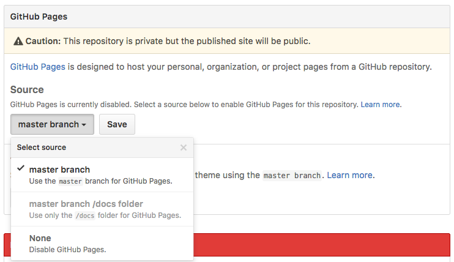

Keeping a master copy of your repo on GitHub is a great way to keep everything backed up, as well as enable team development. But GitHub can also help you publish the contents of that repo to the web so that everyone can see it in their web browser. This feature is known as [GitHub Pages](https://pages.github.com/).

## Enabling GitHub Pages

By default, GitHub Pages is not enabled for new repos. To turn it on, follow these simple steps:

1. Go to your repo's page on the GitHub web site
1. Choose the `Settings` tab
1. On the right side, near the bottom is a setting section entitled `GitHub Pages`: snder the `Source` section, click on the first button labeled `None` and choose `Master Branch` from the drop down. Then click the `Save` button to save this selection.



After you save this change, the files in your repository become web addressable, meaning you can load them into a web browser using a URL that begins with the URL shown in the GitHub Pages settings box. This URL has the following pattern, where `name-of-account` is replaced with the name of the account in which the repo lives, and `name-of-repo` is replaced with the name of the repo.

```
https://name-of-account.github.io/name-of-repo/
```

If you have a file named `index.html` in the root of the repo, then this URL will return that file. If your `index.html` is in a sub-folder, just add the subfolder's name on the end of the URL. For example, to load an `index.html` from a subfolder named `myfolder`, the URL would be:

```
https://name-of-account.github.io/name-of-repo/myfolder/
```

## Options

Enabling GitHub Pages on the `master` branch is the easiest way to get your site published to the web, but there are a few other options in that drop-down.

### Master Branch `/docs` Folder

This enables GitHub pages only for files in a folder named `docs` within your repo. All other files outside of that folder are not web addressable. This is for code libraries that want to host their documentation on a GitHub Pages site, but keep the code itself just in the repo.

This approach can also be used for sites where the published content is actually built from templates and document fragments that live in a separate folder. [This tutorials site](https://github.com/infx-web-win17/tutorials) is an example. Each tutorial is just a document fragment that is merged with a template to create the final published tutorial. My tutorial fragments and meta-data live in a `src` folder, and my scripts build the published site into the `docs` folder.

### The `gh-pages` branch

If you read the section on branching and merging in the [Managing Your Files](../managing-files#sec-branchingandmerging) tutorial, and feel comfortable working with branches, there is another option available to you.

Publishing directly from the `master` branch is something new that was added to GitHub Pages in the summer of 2016. Prior to that, one had to create a new branch in the repo named exactly `gh-pages` and merge commits onto that branch in order to publish your site. Although it's not displayed in the options drop-down, this approach is still supported, and will probably be so for quite some time.

This approach is more complex, as it requires working with branches, but it's also more powerful, because it enables you to work on your site and back it up to GitHub without automatically publishing those changes to the web. Because commits made to one branch are isolated from other branches until you merge them, you can make all the commits you want to the `master` branch, but they won't appear in the `gh-pages` branch until you merge them into it. When you are ready to publish your site, you simply switch to the `gh-pages` branch, merge all the commits from `master`, and synchronize with GitHub to make them available on the web.

## Default Account Repo

