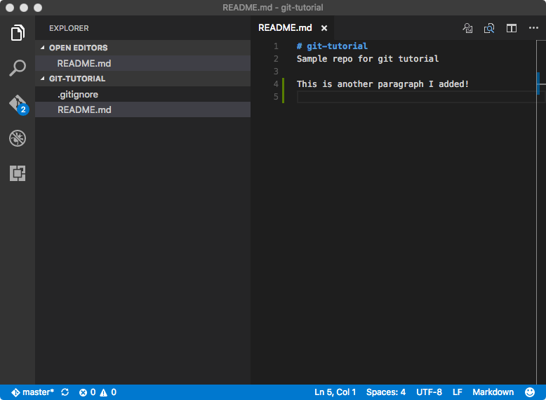

One thing you will quickly discover is that a typical web site involves *a ton* of files. Every HTML page, every CSS stylesheet, every module of JavaScript, and every multimedia asset is a separate file, organized into a folder hierarchy. Even simple sites will have a dozen or more files, and large complex sites typically involve hundreds.

Managing changes to these files by hand can become complex and error prone, especially when a whole team is working on the files at the same time. Moving the files from your local development machine to your web server can also be difficult to manage, especially when you're unsure which files you've modified since you last published the site.

Thankfully, there are a class of tools that are designed to make managing all these files much easier. They are called **version control systems**, and the most popular of these in the open-source community is known as git. Although git can be used without a central server, it is commonly paired with the collaborative, cloud-based repository service [GitHub](https://github.com/), which maintains a copy of your files in a central, secure, and backed-up location.

## What is Git?

Git is a system that can store, retrieve, and merge various versions of your files. It's kind of like Dropbox and Google Docs, but with two big differences:

- New versions of your files must be explicitly committed when they are ready. Git doesn't save a new version every time you save a file to disk. That approach works fine for word-processing documents, but not for programming files. You typically need to write some code, save it, load it in your browser, test it, debug, make some fixes, and test again before you're ready to commit a new version.
- For text files (which nearly all your web development files will be), git pays attention to changes at the line level, and not just the file level. That means it can automatically merge together different changes made to different parts of the same file.

Like Dropbox and Google Docs, git can show you all previous versions of a file and can quickly rollback to one of those previous versions. This is often helpful in web development, especially if you embark on making a massive set of changes, only to discover part way through that those changes were a bad idea (I speak from experience here &#x1F631; ).

But where git really comes in handy is in team development. Almost all professional web development work is done in teams, with involves multiple people working on the same set of files at the same time. Git helps the team coordinate all these changes, and provides a record so that anyone can see how a given file ended up the way it did.

## Git Core Concepts

To understand how git works, you need to understand its core concepts. Read this section carefully, and come back to it if you forget what these terms mean.

- **repository (repo):** an archive containing all the committed versions of all your files, along with some additional metadata, stored in a hidden subdirectory named `.git` within your project directory. If you want to sound cool and in-the-know, call this a "repo."
- **commit:** a set of file versions that have been added to the repository, along with the name of the person who did the commit, a message describing the commit, and a timestamp. This extra tracking information allows you to see when, why, and by whom changes were made to a given file.
- **staging area:** a set of new changes that are ready to be committed to the repository. All changes to all files in the staging area will be included in the next commit, but not changes made to other files that are not in the staging area. This allows you to commit the changes you are done with, while keeping your work-in-progress out of the repository.
- **branch:** a separate stream of changes within a repo that are isolated from each other. All git repositories start with one branch named `master`, but you can create other branches if you wish. Changes committed to one branch are kept separate from those committed to other branches, allowing you to work on new features or crazy ideas without contaminating the `master` branch. Once a feature is complete, you can merge committed changes from the new feature branch into the `master` branch with one quick command.
- **pull request:** a request to merge changes from one branch into another, or from one repository into another. Pull requests allow your team members or bosses to review your changes and approve them before they are merged back into the `master` branch, which is considered the master version of the code.
- **remote:** a link to a copy of this same repository on a different machine. Typically this will be a central version of the repository that all local copies on your various development machines point to. You can push commits to, and pull commits from, a remote repository to keep everything in sync. You can also add more than one remote link if you are working with multiple remote repositories.
- **merge conflict:** a condition that occurs when you merge commits pulled from another branch or repository that include changes to the same lines that you've already changed locally. In this case, git doesn't which version is correct, so you must resolve the conflict by choosing a winner, or manually combining the changes.
- **.gitignore file:** a file in your project's root directory that contains paths or specific files that git should ignore. This is very useful for keeping things out of the repository that should never be in there, such as current workspace settings saved by an Integrated Development Environment (IDE), or files containing login information or secret keys.

## What is GitHub?


Git was made to support completely decentralized development, where developers pull commits from each other's machines directly. But most professional teams take the approach of creating one central repository on a server that all developers push to and pull from. This repository contains the authoritative version the source code, and all deployments to a web server are done by cloning/pulling from this centralized repository.

Teams can setup their own servers to host these centralized repositories, but many choose to use a server maintained by another service provider. The most popular of these in the open-source world is [GitHub](https://github.com). In addition to hosting centralized repositories, GitHub also offers other team development features, such as issue tracking, wiki pages, and notifications. Public repositories on GitHub are free, but you have to pay for private ones.

## What is GitHub Desktop?

The core git system consists of several command-line tools, which you can [download and use](https://git-scm.com/) if you wish. But if you are not comfortable working at the command line, you can use the [GitHub Desktop application](https://desktop.github.com/) instead. This application presents a friendly, easy-to-use graphical user interface (GUI) over the core command-line tools. This GUI does the same thing the command line tools do, so it's fine to use both interchangeably. This tutorial will show you how to use this GUI application.

## Creating a Repo

To help you get comfortable with using git, let's create a test repository on GitHub, clone it to your local machine, make some changes, and push those back up to GitHub. This is just for practice right now, but you will have to do something similar for the [Managing Your Files challenge](https://canvas.uw.edu/courses/1100190/assignments/3514568).

Start by [creating a new repo on GitHub](https://help.github.com/articles/create-a-repo/). Since this is just a test, name it `git-demo`, and give it some sort of description. Keep it public, but make sure you check the box to says you want a README file so that your new repo will contain at least one file.

GitHub repos always live within a particular account, and that account can belong to a single user (like you), or an entire organization. The full name of the repo is a combination of the account name and the repo name, and takes the form of `account-name/repo-name`. A given account may have multiple repos, but each repo must have a unique name within that account. But different accounts may have repos with the same name, as the full name contains both the account name **and** the repo name.

The repositories you will use for the challenges will live inside our course's GitHub organization, and not your individual account. This is because GitHub Education gives us free *private* repositories within an organization we create for a course. Keeping these challenge repositories private ensures that other students can't look at and copy your code.

<p class="alert alert-warning">If you sign up for the <a href="https://education.github.com/pack">GitHub Student Developer Pack</a> you can get unlimited free private repos in your own account while you are still a student (plus a bunch of other discounts).</p>

## Cloning a Repo to Your Development Machine

Creating the repo on GitHub creates the files on GitHub's servers, so to work with them on your local development machine, you need to **clone** the repo to your computer. Cloning creates a copy of the repository on your machine, and it also records where the repo came from as a new remote named `origin`. This allows you to quickly push any changes you make back to the `origin` repository.

To clone a repo, go to the repo's home page on GitHub and click the **Clone or download** button on the right. This gives you a few options, and the one we want to choose is "Open in Desktop." 


After you click that button, you'll probably see a scary-looking dialog that looks something like this:


This dialog is shown by your web browser, and its informing you that the web site would like to launch a tool that is installed on your computer&mdash;in this case, the GitHub Desktop application. The browser asks you to confirm this for security reasons, as it would be bad to let a random web site run a program on your local machine without giving you a chance to stop it. In this case, we do want to launch GitHub Desktop, so click the **Launch Application** button (or whatever button you see that confirms you really do want to run the program).

The GitHub Desktop app will open and ask you where you want to clone the repo on your system. You can choose any location you want, but pay attention to where you clone it; you'll need to open those files in your code editor, so you need to remember where they are. It's a good idea to clone these repos to a consistent place so that you always know where to go. On my machine, I created a folder named `code` inside my home directory, and I clone all my repos to that folder.

After the clone has completed, you will see something like this in your GitHub Desktop app:


This shows you the history of the repo so far, which is pretty minimal. There's only one commit, made by you when you created the repo on GitHub.

## Create a Branch

Although it's not strictly required, it's good practice to create a new branch whenever you want to make significant changes to the files in your repository. This allows you to isolate those changes from the master version of the files in the `master` branch. If you end up deciding your changes were a bad idea, you can simply delete the branch and the `master` branch remains unaffected. If you decide your changes were good, you can then create a pull request so that your teammates or bosses (or teachers) can review your changes.

Create a new branch by clicking the New Branch icon in the toolbar (highlighted here in red). Name your new branch `feature-1`.


After you create the branch, your GitHub Desktop app will looks something like this:


It's switched to showing you all uncommitted changes in your files. Since we haven't changed anything yet, there's nothing to show. Let's make some changes.

## Open the Repo in Visual Studio Code

We will now use Visual Studio code to edit some files in our repo. If you haven't already done so, please read through [The Basics of Visual Studio Code](https://code.visualstudio.com/docs/editor/codebasics) to get familiar with the tool and how it works.

Start Visual Studio Code and choose the `File` menu, and choose the `Open...` menu item. This will display your operating system's standard file open dialog, but with a twist: you can select an open entire folder here. Find your repository folder, which was created earlier when you cloned your repo. Click on the entire folder and choose `Open`. You should see your repo files listed on the left.


## Create an Ignore File

By default git will try to track every file and folder in your repository folder, but there are some files and folders you really don't want to add to your repository. A good example is the `.DS_Store` file that OS X creates when you arrange the icons in a folder. OS X uses this file to track meta-data about the folder, but that's not really part of your code. It's specific to your machine and your machine only, so we don't want to add that to our repository. Other examples include the `.vscode` folder, which Visual Studio code creates to track workspace-specific data that shouldn't be added to your repo.

Thankfully it's easy to tell git to ignore these files. All we need to do is create a file named `.gitignore` and enter all the file/folder names we want git to ignore.

On the `File` menu, choose `New File` to create a new file in your project, and give it the name `.gitignore` (note the leading dot). If prompted, confirm that you really do want to start the name with a dot. After creating the file, add these lines to it and save the file:

```
.DS_Store
.vscode
```

Visual Studio Code should now look like this:


## Edit the README.md File

Let's also edit the `README.md` file. `README` is the traditional name given to a file that explains what a given repository or folder contains. The `.md` extension means this file is saved in the popular [Markdown](http://www.markdowntutorial.com/) format. Markdown is simpler than HTML, yet can be converted easily into HTML, so GitHub uses it for these explanatory files.

Add some more lines to this file, using the [Markdown Cheatsheet](https://github.com/adam-p/markdown-here/wiki/Markdown-Cheatsheet) as a syntax reference. At the very least, add a new paragraph like so:



## Commit your Changes

We've made some changes to our files, but before we can send them back to GitHub, we need to **commit** those changes to our repository. When we commit changes, git automatically captures when the commit was done, who did it, and prompts us to supply a message describing why the commit was done. All of this meta-data is stored with the commit in the repository, and remains visible in the log. This enables us to know exactly who made a change, when it was made, and why.

Return to the GitHub Desktop app. It should show you the changes you've made:


Note that for text files, git tracks changes at the line level. This enables git to **merge** changes to the same file from different developers as long as those developers change different lines in the file. If they change the same lines, the second one to commit will get a **merge conflict** error, and git will ask that developer to resolve which version of the line should remain.

The `Summary` and `Description` boxes are where you can enter a message about what the commit contains and why it's being made. The `Summary` is meant to be a short overview, and the `Description` may contain a longer explanation, or may be left blank. Enter something in the `Summary` box and choose the `Commit to feature-1` button to commit your changes to the repository.


The list of changes should disappear and a message should be shown indicating that the commit was completed. Note that you click the `Undo` button to undo that commit if you decided it was a bad idea.

You can use the `History` tab at the top to view the entire history of the current branch, which at this point contains one commit.


## Publish to GitHub

When you make a new commit, that is saved to your local repo on your machine only. To back it up and share it with others, you should choose the `Publish` button (highlighted in red):


## View Changes on GitHub

After the publish finishes, go back to your web browser and look at your repo's home page on GitHub. By default, it will show you the contents of the `master` branch, which remains unaltered because we committed our changes to the `feature-1` branch. But if you choose the button labeled `Branch: master`, you should see a drop-down that lets you select your new `feature-1` branch:


After you choose the `feature-1` branch, you should be able to see the new `.gitignore` file, as well as your changes to the `README.md` file. Note that if you switch back to the `master` branch, those changes are no longer shown. Commits made to branches are kept separate from one another until you merge them. The best way to do that merging is to use a **Pull Request**, which allows your teammates, bosses, or teachers to review your changes before they get merged into the `master` branch.

## Create a Pull Request


