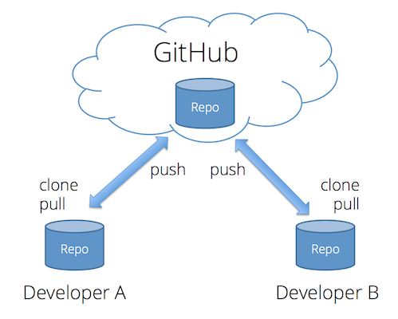
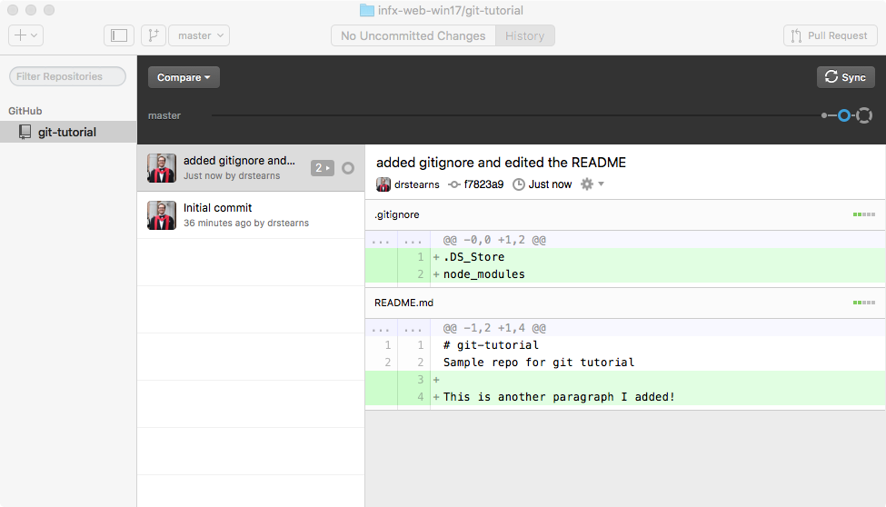
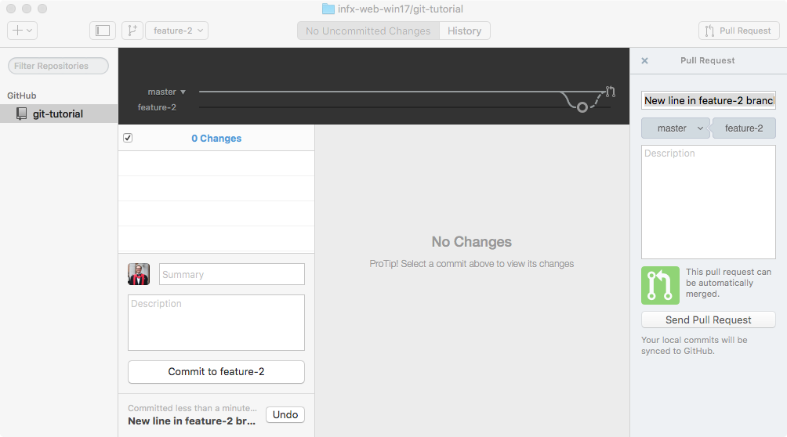

One thing you will quickly discover is that a typical web site involves *a ton* of files. Every HTML page, every CSS stylesheet, every module of JavaScript, and every multimedia asset is a separate file, organized into a folder hierarchy. Even simple sites will have a dozen or more files, and large complex sites typically involve hundreds.

Managing changes to these files by hand can become complex and error prone, especially when a whole team is working on the files at the same time. Moving the files from your local development machine to your web server can also be difficult to manage, especially when you're unsure which files you've modified since you last published the site.

Thankfully, there are a class of tools that are designed to make managing all these files much easier. They are called **version control systems**, and the most popular of these in the open-source community is known as git. Although git can be used without a central server, it is commonly paired with the collaborative, cloud-based repository service [GitHub](https://github.com/), which maintains a copy of your files in a central, secure, and backed-up location.

## What is Git?

Git is an archiving system that can store, retrieve, and merge various versions of your files. It's kind of like Dropbox and Google Docs, but with two big differences:

- New versions of your files must be explicitly committed when they are ready. Git doesn't save a new version every time you save a file to disk. That approach works fine for word-processing documents, but not for programming files. You typically need to write some code, save it, load it in your browser, test it, debug, make some fixes, and test again before you're ready to commit a new version.
- For text files (which nearly all your web development files will be), git pays attention to changes at the line level, and not just the file level. That means it can automatically merge together different changes made to different parts of the same file.

Like Dropbox and Google Docs, git can show you all previous versions of a file and can quickly rollback to one of those previous versions. This is often helpful in web development, especially if you embark on making a massive set of changes, only to discover part way through that those changes were a bad idea (I speak from experience here &#x1F631; ).

But where git really comes in handy is in team development. Almost all professional web development work is done in teams, with involves multiple people working on the same set of files at the same time. Git helps the team coordinate all these changes, and provides a record so that anyone can see how a given file ended up the way it did.

## Git Core Concepts

To understand how git works, you need to understand its core concepts. Read this section carefully, and come back to it if you forget what these terms mean.

- **repository (repo):** an archive containing all the committed versions of all your files, along with some additional metadata, stored in a hidden subdirectory named `.git` within your project directory. If you want to sound cool and in-the-know, call this a "repo."
- **commit:** a set of file versions that have been added to the repository, along with the name of the person who did the commit, a message describing the commit, and a timestamp. This extra tracking information allows you to see when, why, and by whom changes were made to a given file.
- **remote:** a link to a copy of this same repository on a different machine. Typically this will be a central version of the repository that all local copies on your various development machines point to (known as the `origin`). You can push/publish commits to, and pull commits from, a remote repository to keep everything in sync. You can also add more than one remote link if you are working with multiple remote repositories.
- **merge conflict:** a condition that occurs when you merge commits pulled from a remote repository that include changes to the same lines that you've already changed locally. In this case, git doesn't which version is correct, so you must resolve the conflict by choosing a winner, or manually combining the changes.
- **.gitignore file:** a file in your project's root directory that contains paths or specific files that git should ignore. This is very useful for keeping things out of the repository that should never be in there, such as current workspace settings saved by an Integrated Development Environment (IDE), or files containing login information or secret keys.

## What is GitHub?



Git was made to support completely decentralized development, where developers pull commits from each other's machines directly. But most professional teams take the approach of creating one central repository on a server that all developers push to and pull from. This repository contains the authoritative version the source code, and all deployments to a web server are done by cloning/pulling from this centralized repository.

Teams can setup their own servers to host these centralized repositories, but many choose to use a server maintained by another service provider. The most popular of these in the open-source world is [GitHub](https://github.com). In addition to hosting centralized repositories, GitHub also offers other team development features, such as issue tracking, wiki pages, and notifications. Public repositories on GitHub are free, but you have to pay for private ones.

## What is GitHub Desktop?

The core git system consists of several command-line tools, which you can [download and use](https://git-scm.com/) if you wish. But if you are not comfortable working at the command line, you should use the [GitHub Desktop application](https://desktop.github.com/) instead. This application presents a friendly, easy-to-use graphical user interface (GUI) over the core command-line tools. This GUI does the same thing the command line tools do, so it's fine to use both interchangeably. 

This tutorial will show you how to use this GUI application, but if you want to learn the command-line tools, go through the interactive [Try Git](https://try.github.io/levels/1/challenges/1) tutorial on GitHub.

## Creating a Repo

To help you get comfortable with using git, let's create a test repository on GitHub, clone it to your local machine, and make some changes.

Start by [creating a new repo on GitHub](https://help.github.com/articles/create-a-repo/) within your account. Use the following settings when you create the repo:

- Repository Name: `git-tutorial`
- Description: `Sample repo for git tutorial`
- Public vs Private: choose `Public`
- Initialize this repository with a README: ensuire that you check that box so that your repo will contain a README file
- Choose `Create repository`

GitHub repos always live within a particular account, and that account can belong to a single user (like you), or an entire organization. The full name of the repo is a combination of the account name and the repo name, and takes the form of `account-name/repo-name`. A given account may have multiple repos, but each repo must have a unique name within that account. Different accounts may have repos with the same name, as the full name contains both the account name **and** the repo name.

The repositories you will use for the challenges will live inside our course's GitHub organization, and not your individual account. This is because GitHub Education gives us free *private* repositories within an organization we create for a course. Keeping these challenge repositories private ensures that other students can't look at and copy your code.

<p class="alert alert-warning">If you sign up for the <a href="https://education.github.com/pack">GitHub Student Developer Pack</a> you can get unlimited free private repos in your own account while you are still a student (plus a bunch of other discounts).</p>

## Cloning a Repo to Your Development Machine

Creating the repo on GitHub creates the files on GitHub's servers, so to work with them on your local development machine, you need to **clone** the repo to your computer. Cloning creates a copy of the repository on your machine, and it also records where the repo came from as a new remote named `origin`. This allows you to quickly push any changes you make back to the `origin` repository.

To clone a repo, go to the repo's home page on GitHub and click the **Clone or download** button on the right. This gives you a few options, and the one we want to choose is "Open in Desktop." 


After you click that button, you'll probably see a scary-looking dialog that looks something like this:


This dialog is shown by your web browser, and its informing you that the web site would like to launch a tool that is installed on your computer&mdash;in this case, the GitHub Desktop application. The browser asks you to confirm this for security reasons, as it would be bad to let a random web site run a program on your local machine without giving you a chance to stop it. In this case, we do want to launch GitHub Desktop, so click the **Launch Application** button (or whatever button you see that confirms you really do want to run the program).

The GitHub Desktop app will open and ask you where you want to clone the repo on your system. You can choose any location you want, but pay attention to where you clone it; you'll need to open those files in your code editor, so you need to remember where they are. It's a good idea to clone these repos to a consistent place so that you always know where to go. On my machine, I created a folder named `code` inside my home directory, and I clone all my repos to that folder.

After the clone has completed, you will see something like this in your GitHub Desktop app:


This shows you the history of the repo so far, which is pretty minimal. There's only one commit, made by you when you created the repo on GitHub.

## Open the Repo in Visual Studio Code

We will now use Visual Studio code to create and edit some files in our repo. If you haven't already done so, please read through [The Basics of Visual Studio Code](https://code.visualstudio.com/docs/editor/codebasics) to get familiar with the tool and how it works.

Start Visual Studio Code and choose the `File` menu, and choose the `Open...` menu item. This will display your operating system's standard file open dialog, but with a twist: you can select an open entire folder here. Find your repository folder, which was created earlier when you cloned your repo. Click on the entire folder and choose `Open`. You should see your repo files listed on the left.


## Create an Ignore File

By default git will try to track every file and folder in your repository folder, but there are some files and folders you really don't want to add to your repository. A good example is the `.DS_Store` file that Mac OS X sometimes creates within a folder. OS X uses this file to track meta-data about the folder, such as the relative positions of the icons, but that's not really part of your code. It's specific to your machine and your machine only, so you don't want to add that to your repository. Another example is the `node_modules` folder, which gets created when you install dependent modules, and you never need to add to your repository.

Thankfully it's easy to tell git to ignore these files. All we need to do is create a file named `.gitignore` in the repository's root folder, and enter all the file/folder names we want git to ignore.

On the `File` menu of Visual Studio Code, choose `New File` to create a new file in your project, and give it the name `.gitignore` (note the leading dot). If prompted, confirm that you really do want to start the name with a dot. After creating the file, add these lines to it and save the file:

```
.DS_Store
node_modules
```

Visual Studio Code should now look like this:


## Edit the README.md File

Let's also edit the `README.md` file. `README` is the traditional name given to a file that explains what a given repository or folder contains. The `.md` extension means this file is saved in the popular [Markdown](http://www.markdowntutorial.com/) format. Markdown is simpler than HTML, yet can be converted easily into HTML, so GitHub uses it for these explanatory files.

Add some more lines to this file, using the [Markdown Cheatsheet](https://github.com/adam-p/markdown-here/wiki/Markdown-Cheatsheet) as a syntax reference. At the very least, add a new paragraph like so:


Note that Visual Studio Code graphically shows a green gutter bar next to the lines you've added. It uses git to determine which lines have changed within the current file, and shows indicators in the gutter next to those lines.

## Commit your Changes

We've made some changes to our files, but before we can send them back to GitHub, we need to **commit** those changes to our repository. When we commit changes, git automatically captures when the commit was done, who did it, and prompts us to supply a message describing why the commit was done. All of this meta-data is stored with the commit in the repository, and remains visible in the log. This enables us to know exactly who made a change, when it was made, and why.

Return to the GitHub Desktop app. It should show you the changes you've made. If you don't see the changes, make sure you have selected the tab at the top that says `2 Uncommitted Changes`:


For text files, git tracks changes at the line level. This enables git to **merge** changes to the same file from different developers as long as those developers change different lines in the file. If they change the same lines, the second developer to commit will get a **merge conflict** error, and git will ask that developer to resolve which version of the line should remain.

The `Summary` and `Description` boxes are where you can enter a message about what the commit contains and why it's being made. The `Summary` is meant to be a short overview, and the `Description` may contain a longer explanation, or may be left blank. Enter something in the `Summary` box and choose the `Commit to master` button to commit your changes to the repository.


The list of changes should disappear and a message should be shown indicating that the commit was completed. Note that you click the `Undo` button to undo that commit if you decided it was a bad idea.

You can use the `History` tab at the top to view the history so far, which at this point contains two commits.



These commits will stay in your repo forever, allowing you not only to reconstruct the history of a given file, but also revert back to a previous version of the file if you run into problems.

## Sync with GitHub

When you make a new commit, that is saved to your local repo on your machine only. To back it up and share it with others, you should choose the `Sync` button (highlighted in red):


This will push the changes you've committed to your local repo up to the version of your repo on GitHub. It will also pull any new commits that might have been made to the server version that your local copy hasn't seen yet.

## View Changes on GitHub

After the synchronize operation finishes, go back to your web browser and look at your repo's home page on GitHub. You should be able to see the new `.gitignore` file, as well as your changes to the `README.md` file. Click on the file names to view their contents. Your commit message summary will appear to the right of each file, and if you click that message, you'll see all of the lines that were changed in each of the files during that commit. 

## Lather, Rinse, Repeat

You've now completed one cycle of the typical GitHub workflow:

1. Make changes to your files
1. Commit your changes to your local repo
1. Synchronize your local repo with GitHub

Keep practicing by trying the following:

- Make some more changes to the `README.md` file, commit those changes to your local repo, and synchronize with GitHub. Use the [Markdown Cheatsheet](https://github.com/adam-p/markdown-here/wiki/Markdown-Cheatsheet) as a syntax reference.
- Find a picture you like on [Pixabay](https://pixabay.com/), download it and move it to your repo folder, then commit and synchronize. Git can manage any sort of file, including binary media files.

## Advanced Topics

The rest of this tutorial is for students who want to learn the more advanced features of git, including branching, merging, and pull requests. These topics are entirely optional&mdash;you do not need to know these to complete the rest of this course. But if you want to dive deeper, read on....

### Branching and Merging

So far you've made all of your changes to repository on what is called the `master` branch. A **branch** is a separate space within a repository, and every repo starts with one branch named `master`. But you can create as many branches within a repo as you want, and each branch is like an isolated space with its own separate stream of commits. This allows you to safely work on new, crazy features without contaminating the code in the `master` branch. If your feature turns out to be a bad idea, you can just delete the new branch and return to the code the way it was on the `master` branch. But if your feature turned out to be a good idea, you can **merge** the commits you made to the new branch back into the `master` branch, thereby updating the master copy of your code.

To create a new branch, use the new branch button in the GitHub Desktop toolbar:


Name your branch `feature-1` and create it. GitHub Desktop will update to look like this:


Notice that it's graphically showing you that a new branch named `feature-1` has split off from the `master` branch. We can now make changes to our files and commit them to this new branch.

Go back to Visual Studio Code and make some more changes to your `README.md` file. Then return to GitHub Desktop and commit those changes to the `feature-1` branch. Fill out the `Summary` field and choose the `Commit to feature-1` button:


This commit is now isolated just to the `feature-1` branch. Your code on the `master` branch remains unaffected. To see this, switch back to the `master` branch by choosing the branch button in the toolbar, and selecting `master` from the drop-down:


Then return to Visual Studio Code, and note that the most recent change you made to the `README.md` file is no longer there! That's because you are viewing the code on the `master` branch, and your most recent change was made to the `feature-1` branch. Use GitHub Desktop to switch back to the `feature-1` branch, and notice how your edit to the `README.md` reappears!

To merge this commit into the `master` branch, switch back to the `master` branch using GitHub Desktop, and then use the `Compare` button to compare the `master` branch to the `feature-1` branch.


The compare view will graphically show you that one commit has been made to the `feature-1` branch that is not yet in the `master` branch (highlighted in red):


To merge this commit into the `master` branch, choose the `Update from feature-1` button. After the merge completes, choose the `Sync` button to push this newly-merged commit up to GitHub. Your `master` branch should now contain all the same changes you made to your `feature-1` branch. At this point, you can delete the `feature-1` branch, or just keep it around for reference.

### Pull Requests

Merging directly from a feature branch back into `master` is something you can do if you are working alone, but if you are working in a team, you will generally need to let others review your changes before they are merged. This is known as a **code review** and it's an essential part of team-based development.

GitHub enables code review through a feature called **pull requests**. When a developer wants to merge commits made to a feature branch back into `master`, the developer creates a pull request on GitHub, which others can then review. You can do this right from the GitHub Desktop app.

Create another branch named `feature-2`, make some more changes to your `README.md` file, and commit those changes to the `feature-2` branch. Then use the `Pull Request` button to create a new pull request, asking to merge the commits you've made to the `feature-2` branch back into the `master` branch.



Choose the `Send Pull Request` button to create the new pull request on GitHub. After it finishes, you should see a confirmation with a hyperlink that will take you directly to the new pull request:


Click the link to view the pull request in your browser. If you click on the `Files changed` tab across the top, you can see all of the changes in the pull request. If you hover over a line, a blue `+` button appears and if you click that, you can add in-line comments about the changes. This is how teams do formal code reviews.


To merge the pull request, return to the `Conversation` tab and choose the big green `Merge pull request` button. After you confirm, GitHub will merge the commit you made to the `feature-2` branch into the `master` branch.

Since this merge took place on the server, your local copy of the repo doesn't know about it yet. To pull that change into your local repo, return to the GitHub Desktop application, switch to the `master` branch, and choose the `Sync` button to synchronize your local repo with the version up on GitHub. After the sync, you should see a new commit in the history with a title that starts with `Merge pull request #1 from...`

### Keep Practicing

Now that you know how to create branches and pull requests, go through the basic cycle a few more times:

1. For each major new feature, create a new branch.
1. Make changes to your files, and commit those changes at the end of each work session.
1. When you are done with the feature, either directly merge the commits back into the `master` branch, or create a pull request to facilitate a code review.
1. If you merge on the server, synchronize your `master` branch to pull the new commits down from the server.

Soon this will feel normal and you won't even have to think about it.